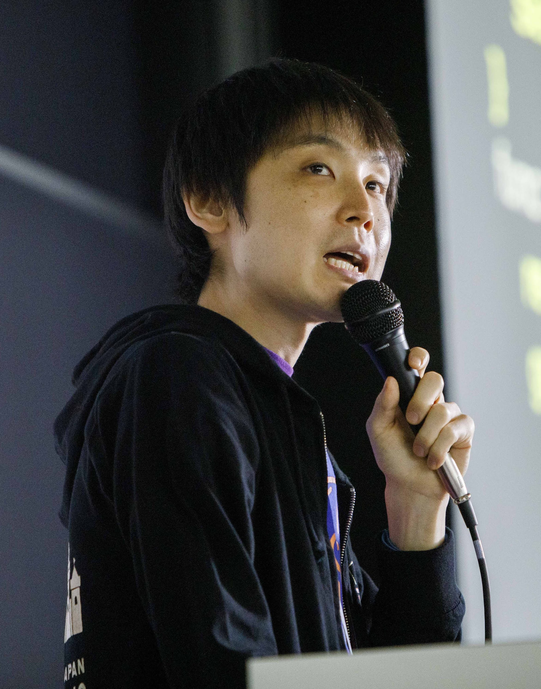

# 職務経歴書

**高田 新山 (Shinzan Takata)**

**元 CTO × 現役大手 IT エンジニア ／ IT と業務の「交通整理」専門家** エンジニアとしての「技術力」と、CTO としての「経営視点」の両面から、あなたの会社のサイドブレーキを外し、VISION への全速力を支援します。

---

## ■ プロフィール（自己紹介と想い）

はじめまして。大手 IT 企業で現役エンジニアとして働きながら、中小企業向けに「IT と業務の交通整理」を行っている高田です。

【なぜやっているのか】
25 歳の時、素晴らしい志を持った起業家の仲間が、日々の雑務やツールの不便さ（泥沼の Have-To）に忙殺され、VISION を見失っていく姿を目の当たりにしました。 「志」が「手段」に殺されるのを、二度と見たくない。 その強い想いから、経営者が 100%VISION に向かって走れるよう、泥沼の業務フローを整え、最適な IT を導入する「VISION 加速エンジニア」として活動しています。

単なるシステム開発の請負やツールの販売はしません。私はあなたの隣に座り、同じ方向を見ながら IT の「セカンドオピニオン」として伴走します。

---

## ■ 私が提供できる 3 つの価値（得意領域）

- **業務のレントゲンと「交通整理」（標準化・属人化解消）**
  - 課題：「誰が何をしているか分からない」「〇〇さんが休むと業務が止まる」
  - 解決： 現状の業務フローを可視化（レントゲン）し、不要な作業を断捨離。誰でも回せる仕組みに整えます

- **経営者と IT ベンダーの「通訳」（コスト最適化）**
  - 課題：「見積もりが高すぎる気がするが、判断できない」「言われるがまま導入して失敗した」
  - 解決： 大手 IT 企業の現役エンジニアの知見を活かし、ベンダーの提案をジャッジ。不要な機能を削り、適正価格に抑えます

- **「サイドブレーキ」を外す IT 導入（DX 支援）**
  - 課題：「ツールを入れたが現場が使いこなせない」
  - 解決： 現場の「嫌な作業（Have-To）」を減らすことを第一目的とした、地に足の着いたツール選定と定着支援を行います

---

## ■ 職務経歴詳細（プロジェクト実績）

### LINE ヤフー株式会社

**2020 年 4 月 〜 現在**

#### OSPO（オープンソース・プログラム・オフィス）

**役割：サブリーダー / 技術ガバナンス**

* **【組織ルールの策定】** エンジニアを中心とした組織全体が OSS を安全に利用するための法的・技術的ガイドラインを策定・運用

#### 大規模チャットアプリ開発 (iOS)

**役割：テックリード(最大 8 名チーム) / 設計責任者**

* **【技術的意思決定】** 200 名規模のチームにおいて、アプリ全体の構造の方針決定やアーキテクチャ選定をリード
* **【品質マネジメント】** チームのレビュー体制の強化により、手戻り工数を削減

### 株式会社オフィス狛（CTO 在任期間含む）

**2014 年 10 月 〜 2018 年 10 月**
**役職：CTO（最高技術責任者）**

**【DX 推進・コンサルティング実績】**
顧客（経営者・現場責任者）と直接対話し、**「業務課題の発見」から「システム化の範囲決定」「実装」までを一気通貫**でリードしました。

| プロジェクト（課題） | 上流工程での取り組み・成果 | 使用技術 |
| :--- | :--- | :--- |
| **物流管理 DX** (アナログなパレット管理の脱却) | **【業務フロー再設計】** 「目視確認」が必要だった業務フローを RFID で「自動検知」へと刷新し、人為的ミスの排除と検品作業の効率化を実現。 | Swift, C# |
| **店舗防犯 DX** (監視業務の省人化) | **【技術選定】** 遠隔地からでもリアルタイムに店舗状況を確認できる仕組みを構築し、オーナーの巡回業務の負担を軽減。 | iOS, WebRTC |
| **機材在庫管理 DX** (棚卸しミスの削減) | **【UX 設計】** 現場スタッフが直感的に操作できる UI を設計。手動管理からの完全移行を達成。 | Swift, PHP |
| **IoT 位置特定システム** (高精度な動線分析) | **【PoC 検証】** Raspberry Pi を用いたプロトタイプを短期間で作成し、技術的な実現可能性を早期に検証。 | Node.js, PHP |

※ その他、基幹システムのリプレイス設計など多数。

---

## ■ 技術スタック（実装等の知見）

※自ら手を動かすことも可能ですが、現在は主に**設計・レビュー・技術判断**にて知見を活用しています。

* **モバイル:** Swift (iOS) 10 年, Kotlin (Android) 1 年
* **バックエンド:** C# (.NET) 6 年, Java (Spring) 8 年, PHP 6 年, Node.js 4 年
* **インフラ:** AWS, GCP, SQL Server, MySQL

---

## ■ アウトプット・活動

* **技術書著者:** [Amazon 著者ページ](https://www.amazon.co.jp/stores/%E9%AB%98%E7%94%B0%E6%96%B0%E5%B1%B1/author/B0CD9LM197)
* **GitHub:** [stzn](https://github.com/stzn)
* **SpeakerDeck:** [shiz](https://speakerdeck.com/shiz)
* **Qiita:** [shiz](https://qiita.com/shiz)

---
## ■ お問い合わせ

**【限定募集】30 分の無料「業務レントゲン」実施中**

「とにかく雑務に追われて、本来の VISION に時間が使えない」 「システムを入れたいけれど、何から手をつけていいか分からない」

そんな経営者の方へ。まずは 30 分、オンラインでお話を伺い、あなたの会社の「見えないサイドブレーキ」の正体を特定します。難しい IT 用語は使いません。

[申し込みフォーム](https://forms.gle/CZkGDmM7PiZpLn746) または [メール](mailto:shinzan@shinzan-jp.com) からお気軽にお声がけください！